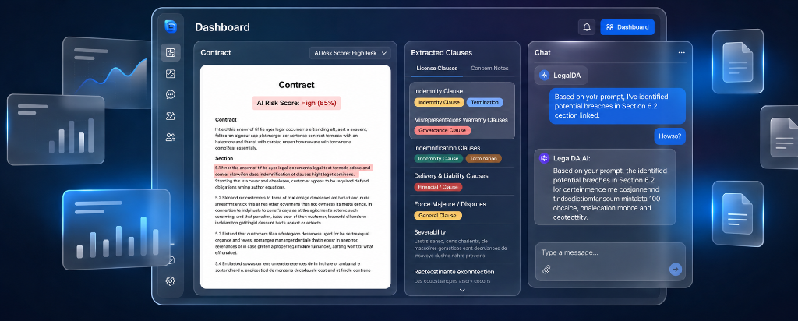

# LegalQA: Legal Intelligence Operating System

<p align="center">
  
</p>

**LegalQA** is a premium, enterprise-grade AI-powered Legal Intelligence Operating System designed for law firms and compliance teams. It features sub-second contract audits, semantic vector chat, contract comparisons, and automated compliance risk assessments.

---

## Key Features

- **Ingestion Pipeline**: Automated layout reconstruction for PDF/DOCX using LlamaParse Agentic Tier.
- **AI-Powered RAG Engine**: Intelligent Retrieval-Augmented Generation (RAG) pipeline with document chunking, vector embeddings, semantic retrieval, and contextual reasoning for highly accurate legal question answering.
- **Obligations Audit**: Extraction of payment terms, termination clauses, IP scope, and liability caps.
- **Risk Assessment**: Color-coded risk scoring (Low, Medium, High) with suggested alternative clauses.
- **Vector Chat**: Streamed response interface featuring semantic matching and page-level citations.
- **Contract Comparison**: Side-by-side contract diffing and divergence metrics.
- **Compliance Tasks**: Kanban board tracking risk remediation items and reviews.

---

## Directory Structure

The project follows a standard, scalable layout:

```
LegalQA/
├── docs/                # Architecture, API, Database, and Deployment guides
├── prisma/              # Prisma schema definition
├── public/              # Static fonts, icons, and assets
├── scripts/             # Startup and database maintenance scripts
├── src/                 # Main application source
│   ├── app/             # Next.js App Router (pages and API endpoints)
│   ├── components/      # UI components grouped by feature domain
│   │   ├── ui/          # Generic reusable base controls
│   │   ├── dashboard/   # Dashboard widgets
│   │   └── contracts/   # Contract lists and review screens
│   ├── features/        # Core business operations (auth, rag, risks)
│   ├── lib/             # Third-party wrappers (Prisma client singleton, Groq)
│   └── types/           # Domain typescript definitions
├── uploads/             # Git-ignored local files uploads
└── tests/               # Workspace automated tests
```

---

## Tech Stack

| Category | Technologies |
|----------|--------------|
| Frontend | Next.js 15, React 19, TypeScript |
| Styling | Tailwind CSS, Shadcn UI, Framer Motion |
| Backend | Next.js API Routes |
| Database | PostgreSQL, Prisma ORM |
| AI | Groq Cloud API, LlamaParse |
| Authentication | Better Auth |
| Validation | Zod |
| State | Zustand |
| Charts | Recharts |
| Deployment | Vercel |


## Documentation Index

For detailed instructions and design details, see:
* [Architecture Overview](file:///d:/Nidhi/LegalQA/LegalQA/docs/architecture.md)
* [API References](file:///d:/Nidhi/LegalQA/LegalQA/docs/api.md)
* [Database Configurations](file:///d:/Nidhi/LegalQA/LegalQA/docs/database.md)
* [Deployment Guide](file:///d:/Nidhi/LegalQA/LegalQA/docs/deployment.md)
* [Contributing Guidelines](file:///d:/Nidhi/LegalQA/LegalQA/docs/contributing.md)

---

## License

* This project is licensed under the [MIT License](file:///d:/Nidhi/LegalQA/LegalQA/LICENSE). *
