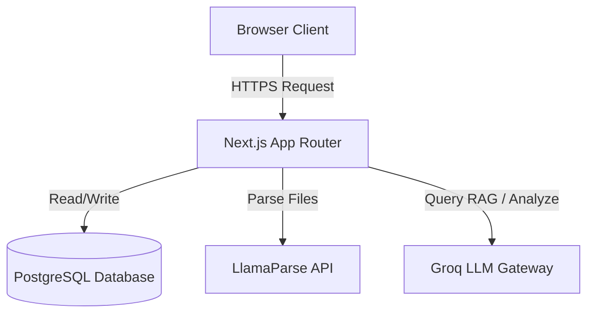

# Architecture Overview

This document describes the high-level architecture of **LegalQA**, a premium Legal Intelligence Operating System built for legal firms and corporate compliance teams.

## Technology Stack

- **Framework**: [Next.js 16 (App Router)](https://nextjs.org/) for server-side rendering, API routes, and client-side page transitions.
- **Database**: [PostgreSQL](https://www.postgresql.org/) running locally without Docker.
- **ORM & Client**: [Prisma ORM](https://www.prisma.io/) with custom `@prisma/adapter-pg` singleton driver setup to prevent connection leaks under Prisma 7.
- **RAG & Extraction**: [LlamaParse](https://llamaindex.ai/) for high-fidelity agentic PDF/DOCX text parsing and layout reconstruction.
- **LLM Gateway**: [Groq SDK](https://groq.com/) utilizing high-throughput models (like Llama-3-70b) for sub-second legal obligations and risk auditing.
- **UI & Aesthetics**: Custom CSS, [Framer Motion](https://www.framer.com/motion/) for smooth animations, and [Recharts](https://recharts.org/) for analytics visuals.

## System Components

### 1. Ingestion Pipeline
When a user uploads a legal agreement (PDF or DOCX):
1. The document is received by `src/app/api/contracts/route.ts`.
2. The raw file buffer is passed to `src/lib/ai/parser.ts`.
3. If LlamaParse credentials are configured, the parser uploads the document to the Llama Cloud file registry, creates an agentic parsing job, and polls for the completed markdown representation.
4. If LlamaParse is unavailable, the parser falls back to local parsing using the `PDFParse` class or the `docx` ZIP XML parser.
5. The extracted text is then chunked into overlapping blocks of `1000` characters (with `200` characters overlap) and saved into the database.

### 2. Analytical & Audit Engine
When a user runs an audit on a contract:
1. The analysis route fetches all document chunks from the database.
2. The chunks are compiled into structured analysis prompts.
3. The system queries Groq with strict JSON output schemas matching the `Risk` and `Clause` database models.
4. The output is parsed and transactionally saved to update the contract's risk metrics, compliance indicators, and suggested text rewrites.

### 3. Vector Search & AI Chat
1. The user inputs questions about uploaded documents in the AI Chat portal.
2. The API uses a custom similarity search function (`match_chunks`) implemented directly inside PostgreSQL via PL/pgSQL.
3. The matching chunks are retrieved as context citations.
4. Groq streams the final completion back to the user client alongside structural citations.
